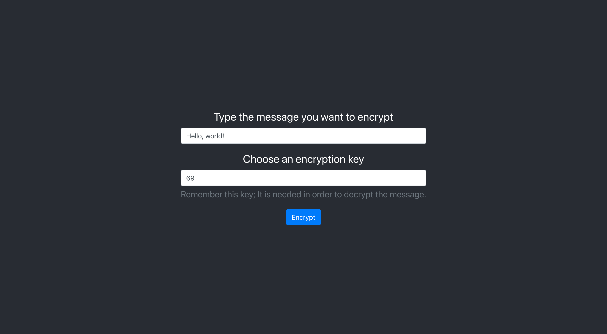
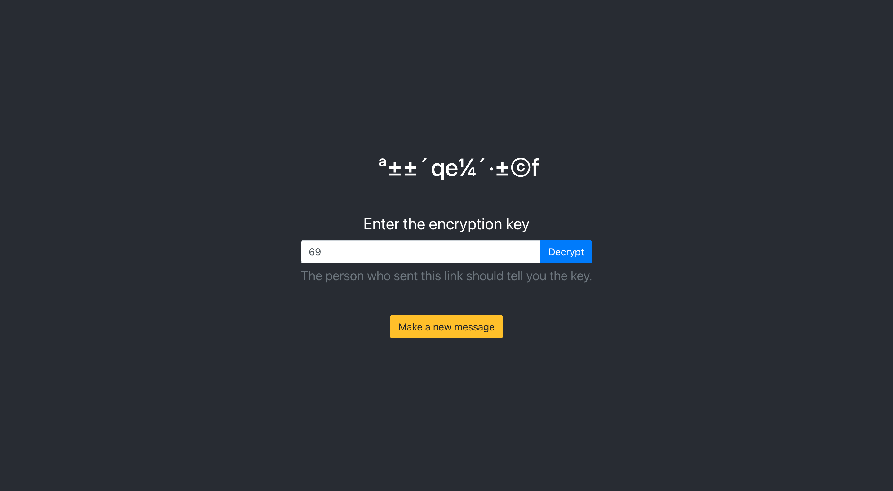
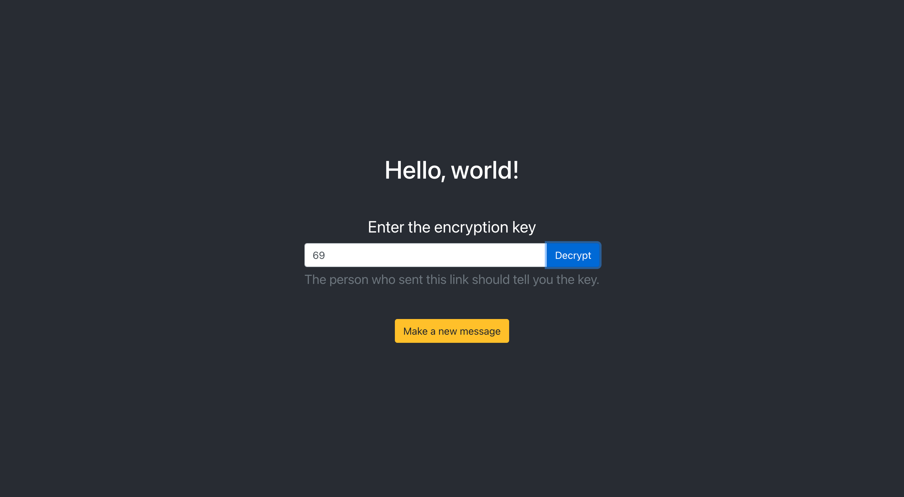

# [Secret Message](https://secret-message-tjc.herokuapp.com/)


[](LICENSE)
[](code_of_conduct.md)

This is a simple encryption/decryption app that runs 100% client-side. This is accomplished encrypting the message with a user defined integer key and adding the encrypted message to the url path. The resulting page displays the encrypted message where the user can enter encryption key to decrypt the message.

[](https://secret-message-tjc.herokuapp.com/)

```DISCLAIMER: The encryption used in this app is NOT cryptographically safe and should not be used to encrypt anything important. I created this app as a proof-of-concept and for my own education/experience.```

## Usage

Navigate to <https://secret-message-tjc.herokuapp.com>. You will see the main page with an input to enter a message to encryption and an input that takes an integer key. Type in your desired message and key, and make sure you remember your key!


Press the blue ```Encrypt``` button, and the browser will redirect to the message page.



You can enter the encryption key yourself and click the blue ```decrypt``` button to see the message you entered on the previous page.



Because the encrypted message is part of the url path, that url can be shared with someone whom you want to see your message; just make sure you tell the person you're sending the message to the key so that they can decrypt and understand the message.

## Installation

If you plan on contributing, or would otherwise want to play around with a development build, clone this repo using your favorite of the following 3 commands:

```git
git clone https://github.com/thadkingcole/secret-message.git
```

OR

```git
git clone git@github.com:thadkingcole/secret-message.git
```

OR

```git
gh repo clone thadkingcole/secret-message
```

Then run the following commands to start the react development server.

```shell
cd secret-message
npm i
npm run
```

## Contributing

Your contribution is most welcome! Please refer to the contributing guidelines when making contributions to this project.

Please note that this project is released with a [Contributor Code of Conduct](code_of_conduct.md). By Participating in this project, you agree to abide by its terms.

## Known Issues

Due to the method of "encryption" used, there are some combination of characters & keys that are incompatible with being stored in the url path. Additionally, only messages of a certain length can be successfully encrtyped and decrypted, so the shorter the message, the higher likelihood of success.

Also, this type of "encryption" is not crytographically safe. It is fairly easy to reverse-engineer the encryption key to decode the message. This work is more of a proof-of-concept for serverless storage of information using the url path that is then available client-side by different users/machines.

## Questions

Please direct any and all questions to [thadkingcole](https://github.com/thadkingcole) or via email at [thadjcole@gmail.com](mailto:thadjcole@gmail.com).

## Credits

I would like to thank the following people/projects/resources:

- [ASCIIchart.com](https://asciichart.com) is an excellent resource for showing what the corresponding character codes are.

## License

[MIT](LICENSE) copyright (c) 2020 [Thaddeus Cole](mailto:thadjcole@gmail.com).
